---
rascaltwo-ai-setup:
  kind: tool
  state: true
  deletion-policy: retain
  integrates:
    timeline-studio: reads the plan, writes comments, sessions and the Review (border) channel
    herdr: one tab per run, in a space per project, read through `herdr agent list`
    claude-code: interactive sessions with --dangerously-skip-permissions
    launchd: [com.rascaltwo.kelpie.tick]
    ai-tidemark: reads its weekly usage records for the usage gate
  requires:
    commands: [bun, git, herdr, claude]
  platforms: macOS (launchd); the rest is portable
---

# kelpie

Hands tasks you've **signed off** (`refinedAt`) and **delegated** (For: Agent, in the
project's Project colour) to autonomous Claude Code agents, one herdr tab per task. Each agent works
in its own folder, hands its work back for review, takes your feedback, and ships the
task once you mark it Approved. Your part: refine the task, review it, approve it.

The design was settled in a grilling session and a steelman pass, then reshaped in use (the
lane per project became For: Agent; a console was built and retired for working from herdr,
see the git history). The reasons that still matter are under *Decided against* below.

## How a task moves

```mermaid
stateDiagram-v2
  [*] --> working: tick dispatches (signed off, For: Agent, gate open)
  working --> waiting: agent runs `review` (or it goes quiet at a prompt for stall_minutes)
  waiting --> working: you comment, type in the pane, or mark Changes requested
  waiting --> shipping: you mark Approved
  shipping --> [*]: agent productionalizes, runs `finish`; tick cleans up
```



**When nothing signed off is ready, the agent refines instead.** The best-ranked delegated
task that is held up only by a missing sign-off gets a *refine* run. It reads the project, drafts a description (what and why, done when, how to verify,
scope), and asks its questions through the same Needs review loop. It never writes code,
never starts the task, and never signs it off. It ends by making the task's **spec page** (the `spec-viz` skill): the human judges each example there, and its gated Sign off button runs the sign-off. When you sign it off, the refine run is
closed and the task starts over as ordinary work. Only tasks you delegated are refined. [`refine.md`](refine.md) is its briefing.

**The tracker is the truth.** Nothing is stored except `state.json`, a cache of stall
timers. A run's state is read every tick from three things:
- the task's status;
- its **Review** value (the plan's `border` channel);
- the `[dispatch] …` comments this tool writes.

Your comments are told apart from the tool's by their `by` author (`kelpie`),
never by their text.

**Models.** Refines run on Sonnet 5.5 (high effort), the same as a default build: they write the spec page, and changing models part-way isn't worth it. A refine ends the task's description with
`Build with: sonnet` (Sonnet 5.5, high: the default) or `Build with: opus` (Opus 5.5, medium: wide
or cross-cutting changes), and your sign-off approves it along with the rest of the description; the
build starts on that model. The table is `MODELS` in `dispatcher.ts`.

**Capacity.**
- Building and refining have separate capacity, so a refine run never holds up a build.
  Each project has one build slot and one refine slot. A run holds its slot from start until it is
  finished (a refine signed off, a build done), including while it waits on you.
- Projects don't share those slots: with three projects, three builds and three refines can run at
  once. The tick starts at most one new build and one new refine per pass (every 5 minutes), so
  projects start staggered while usage data catches up.
- A new task starts only while weekly usage is under the even-pace line:
  `used% ≤ elapsed% × ceiling`, from ai-tidemark's newest record. Stale data counts as a
  shut gate. Replayed against three weeks of tidemark history before it shipped, it stayed
  shut for the whole 98%-used week and was open 86–100% of the time in the ~45%-used weeks.
- Runs already in flight always continue: replies, shipping and restarts all go ahead.

**Safety is guidance, by choice.** Agents run with `--dangerously-skip-permissions`, and
[`prompt.md`](prompt.md) tells them to touch nothing in production or on the internet
until you approve. Nothing enforces that rule.

## Pieces

| File | Does |
|---|---|
| `dispatcher.ts` | All the logic: config, derived state, the usage gate, task folders, the tick and the agent commands. |
| `timeline-studio.ts` | The `Tracker` for Timeline Studio, the only code that knows its API. |
| `herdr.ts` | The `Herdr` side: spawning tabs, reading agent state, relaying prompts. |
| `kelpie.ts` | The CLI: `tick`, `status`, `pause`, `resume` and `refine-next` for you and launchd; `review "<handover>"`, `input`, `comment`, `history`, `finish` and (refine runs only) `describe` for agents, plus `signoff`, `approve` and `close`, which an agent runs only on your explicit word in its pane and which quote what you said into the task. |
| `prompt.md` | The briefing a working agent gets, with the project file's body appended. |
| `refine.md` | The briefing a refine run gets. |
| `actions.ts` | What you start by hand past the limits: `refine-next`. |
| `wiring.ts` | The real dependencies the CLI wires together. |

## Working from herdr

Each project's agents run in their own herdr space ("Timeline Studio"), created on first use
with a shell tab at the project's repo, so your own space holds only your terminals. Each agent
runs in a tab named for its task: ✎ for a refine run, ⚒ for a build. It hands over in its pane
(what it did, then what it needs from you), and `review` records those same words on the task. Answer
it by typing in its pane (it logs what you said) or by commenting on the task. Tell it to sign
off, approve or close the task and it does so itself, quoting your words into the task's history;
it never does any of the three on its own judgment. Signing off, closing and finishing end the run, so the agent's pane
closes 10 seconds later. `kelpie.ts pause` stops new runs
starting (running agents, relays, restarts and clean-up carry on) until `resume`. When you're idle,
`kelpie.ts refine-next` refines the best-ranked handed-over task nobody has refined yet,
past the limits. Builds start only from the tick, one at a time, so two never touch the same code.

## Configure

`~/.config/kelpie/config.json` is optional. These are the defaults:

```json
{ "ceiling": 0.85, "stall_minutes": 15, "stale_minutes": 30 }
```

There is one file per project at `~/.config/kelpie/projects/<id>.md`. Rename
it away from `.md` to disable the project.

```md
---
color: timeline-studio          # optional: its Project colour id; defaults to the file name
space: Timeline Studio          # optional: the herdr space its agents run in; defaults to the id in Title Case
repos:                          # optional; each becomes a worktree on agent/<task-id>
  - path: ~/Desktop/Desktop/Code/timeline-studio
    base: private/trunk         # branched off and merged back into
setup: ["bun install"]          # run once in each fresh worktree
checks: ["bun test"]            # the agent runs these before asking for review
productionalize: |              # what "ship it" means once you approve; empty = nothing to ship
  Merge agent/<task-id> into private/trunk. Do not run ./squash-to-main.sh.
---
Anything the agent should know about this project.
```

## Install

Each step ends with a check. Don't move on until it passes.

1. **Plan setup**, once, in Timeline Studio:
   - Relabel the `border` channel to "Review".
   - Add the border values `Needs review`, `Changes requested` and `Approved`. The tool
     finds them by label.
   - Add a `For` (shapes) value labelled `Agent`. Delegating a task = For: Agent; the
     tick also sets `noQueue` on it, so it never waits behind your own queue.

   Check: the Review chips show in the legend.
2. **A project file**, as above. Check: `./kelpie.ts status` lists the project
   and shows the gate.
3. **The launchd job.** The plist is checked in with placeholder paths:
   ```sh
   p=tools/kelpie/launchd/com.rascaltwo.kelpie.tick.plist
   sed -e "s|/Users/YOUR-USER/.agents/ai-setup|$PWD|g" -e "s|/Users/YOUR-USER|$HOME|g" $p > ~/Library/LaunchAgents/$(basename $p)
   launchctl bootstrap gui/$(id -u) ~/Library/LaunchAgents/$(basename $p)
   ```
   Check: `~/.agents/state/kelpie/tick.log` gains no `tick failed` lines, and
   `launchctl list | grep kelpie` shows exit status 0.

## Tests

`bun test tools/kelpie` runs the tick and the agent commands against an
in-memory tracker and a fake herdr. Task folders are real worktrees of a throwaway git
repo.

## Decided against

- **A 5-hour usage gate.** Only the weekly even-pace line gates new runs, by your call
  during the grilling.
- **A `pushurl` guardrail** (or any enforced sandbox). Safety stays guidance: the briefing
  and your word, by choice.
- **Unlimited restarts.** A run that dies three times in one round is flagged for you
  instead; deaths across a reboot don't count.

## Known ceilings

- **Order is your rank, else the plan's rank suggestion.** Delegated tasks with neither
  go last, in plan order.
- **An agent working in circles isn't detected.** Only a pane that stops changing for
  `stall_minutes` is flagged. If herdr reports it `idle` or `blocked`, that is the agent waiting on you
  (a comment `[dispatch] idle: …`, Needs review), not a stall; only `unknown` is "stalled". A pane
  with a background shell, subagent or workflow running is never flagged: each agent's Stop hook
  (`kelpie bg`) records them in the run folder's `.background`.
- **A spec page's Send corrections and Sign off reach the agent at once.** The page's backend runs
  `kelpie page "…"` (your words, as a comment authored by you, relayed to the pane now) and, on
  sign-off, tells the pane its run is over before the tick closes it.
- **Comments only reach an agent while its run waits on you.** While it works, type into
  the pane.
- **A folder whose work isn't shipped is kept, never deleted.** That means uncommitted
  changes, or a branch not merged into `base`. It gets a `.kept` file and a comment on the
  task. Clean it up by hand.
